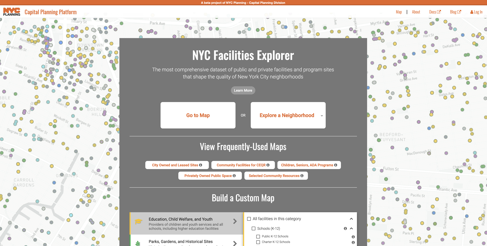

# The Capital Planning Platform

> A Single Page Application(SPA) for the various front-end map and data tools produced by the NYC DCP Capital Planning Team

[](capitalplanning.nyc.gov)

## Architecture
As an SPA, all of the business logic and routing are done client-side.  The app is comprised of various React.js Components and makes use of React-Router for client-side routing. The React JSX files are built with webpack to create a single `bundle.js` file.

The app makes heavy use of various web mapping technologies, including raster maps and interactivity served from a carto server, and client-side map rendering in leaflet.js and mapboxGL.js.

At the time of writing, the app is "backendless", and is using an in-house carto server as both its datastore and tiler.  The carto SQL api allows us to pass in SQL statements using AJAX and getting back JSON or geoJSON results for use in the app.  The carto maps api allows for the on-demand creation of custom vector and raster tiles, which can be displayed in the app using carto.js (leaflet) or mapboxGL.js

We are not storing carto api keys in the client-side code, so all interactions with the carto server are read-only. 

## Main Products

Our initial products are map-based data explorers for Capital Planning's 3 new data products

### Capital Projects
A consolidated web map of NYC capital projects using agency-sourced data.  Users can filter by sponsor/managing agency, data, source, etc, and can click individual project geometries to get full details on a project

### Faciities
Facilities DB is a new dataset of government-related facilities.  The map application includes various filters by domain, group, and subgroup, and also has set pages for some specific queries of the data.

### Housing Pipeline
Shows locations of new housing units compiled primarily from DOB permit records and certificates of occupancy.


## Develop
Since `staging` will likely be ahead of `master`, do work in feature branches off of `staging`, incorporate/publish to production by creating PRs from `staging` into `master`.  

To get serve the project locally:

1. Clone this repository 
    ```sh
    git clone https://github.com/NYCPlanning/capital-planning-platform.git
    ```
2. Navigate to the directory
    ```sh
    cd capital-planning-platform
    ```
3. Install dependencies
   ```sh
   npm install
   ```
4. Serve locally
   ```sh
   # uses webpack dev server to bundle and hot reload
   npm run devserve
   ```
5. Go to `localhost:8080` in your web browser

## Deploy  
The SPA is hosted on Netlify.  
- `master` branch is automatically deployed to capitalplanning.nyc.gov.  
- `staging` branch is automatically deployed to 
  - each pull request will get a preview deploy for viewing before merge.  See the PR for details on the URL for this preview deploy, or head to the application on Netlify.


#### Updating data

Carto table names are stored in `app/config/db_tables.js`. To update a dataset, simply point to the latest table, making sure the schema is the same.

After pointing to a new table, run `yarn generate-totalcounts`. This script queries Carto, getting total counts of rows and other metadata used by the app.
